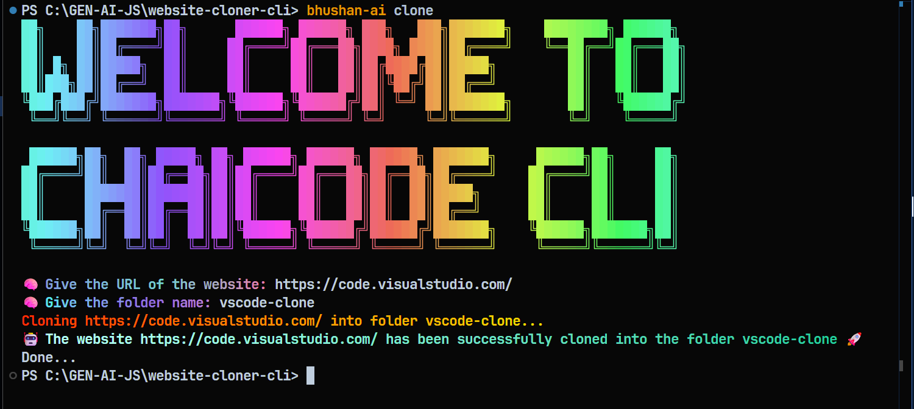

# 🌐 Website Cloner CLI

A simple Node.js powered **command-line tool** to clone any public website (HTML + CSS + JS + Assets) into a local folder for offline usage and learning.  

---
## 📸 Screenshots

### 🚀 CLI Banner



## ✨ Features

- 🚀 Clone websites using a single CLI command  
- 📂 Saves HTML, CSS, JS, images, and other assets locally  
- 🎨 Beautiful CLI with gradient banners and prompts  
- 🤖 Powered by [Puppeteer](https://pptr.dev/), [Axios](https://axios-http.com/), and [Cheerio](https://cheerio.js.org/)  
- 🛠 Great for **learning**, **backups**, or **offline demos**  

---

## 📦 Installation

1. Clone this repo:
   ```bash
   git clone https://github.com/bhushan-ai/website-cloner-cli.git
   cd website-cloner-cli
